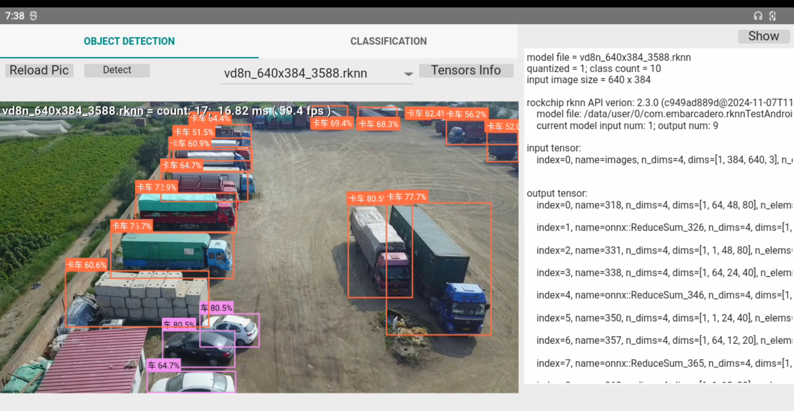
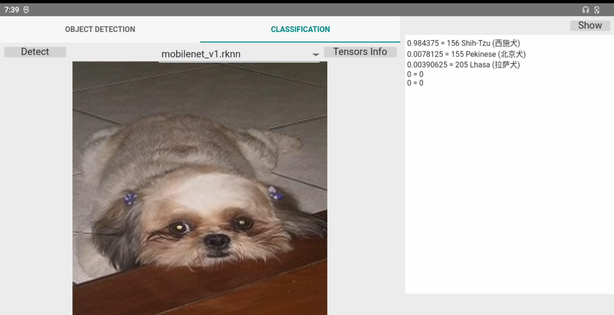
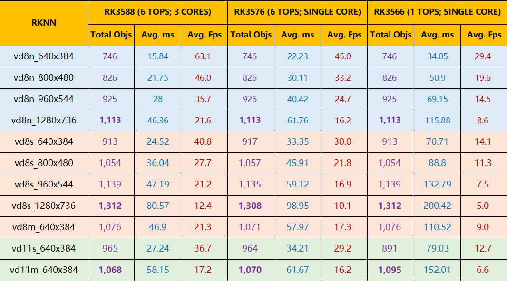

# rknn4Delphi

---

### what is rknn4Delphi

RKNN (Rockchip Neural Network) is a high-performance deep learning inference framework developed by Rockchip, specifically optimized for embedded devices and edge computing scenarios. It enables the conversion of models trained in mainstream frameworks (e.g., TensorFlow, PyTorch, Caffe) into a specialized format that runs efficiently on Rockchip SoCs with NPU acceleration (such as RK3588, RK3566 series). Leveraging hardware-level acceleration and model quantization techniques, RKNN dramatically improves the inference speed and energy efficiency of AI models on embedded systems. It is widely used in AIoT applications like smart cameras, robotics, and industrial inspection. more details see at  [GitHub - airockchip/rknn-toolkit2](https://github.com/airockchip/rknn-toolkit2)

**rknn4Delphi** wraps the RKNN C++ API interfaces, enabling Delphi developers to directly utilize the RKNN inference framework within Delphi. Since Delphi does not support ARM Linux, **rknn4Delphi** is currently available exclusively for Android platforms. By bypassing JNI and directly encapsulating native interfaces, the library achieves higher performance. Deployment follows the standard Delphi Android application workflow, requiring no additional steps beyond standard Delphi Android project configurations.

**Prerequisites for using rknn4Delphi**:  
Basic knowledge of deep learning is required, and models must be converted to the RKNN format. For model conversion guidance, refer to the official repository: [GitHub - airockchip/rknn_model_zoo](https://github.com/airockchip/rknn_model_zoo).

**Compatibility**:  
rknn4Delphi has been tested and validated on **RK3588**, **RK3576**, and **RK3566** chips using **INT8 quantization**. For benchmark results of inference speeds, please refer to the table below:

### How to use

Add 

    .\source\rknn_api.pas
    .\source\rknnBase.pas
    .\source\rknnClassification.pas
    .\source\rknnDetection.pas

to your project, reference the example project .\example\\_rknnTestAndroid

**Note**: The models used in the sample programs are optimized for RK3588 chips. To run these models on other chip models (e.g., RK3566, RK3576), you will need to convert the models accordingly for your target hardware.

欢迎Delphi的老人们一起来交流，加入 **Delphi玩转AI** 群一起来变年轻

